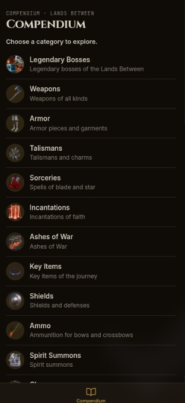
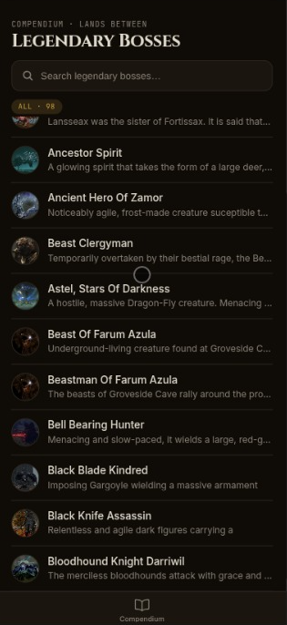

# Elden Ring Compendium

A compendium/wiki app about the game **Elden Ring**, built with **React Native** and **Expo**, consuming the [Elden Ring Fan API](https://eldenring.fanapis.com/).

## Features

- Main menu with navigable categories
- Item listing by category
- Details for each item
- 15 available categories:

  | Category | Description |
  |---|---|
  | Legendary Bosses | Legendary bosses |
  | Weapons | Weapons |
  | Armor | Armor |
  | Talismans | Talismans |
  | Sorceries | Sorceries |
  | Incantations | Incantations |
  | Ashes of War | Ashes of War |
  | Key Items | Key items |
  | Shields | Shields |
  | Ammo | Ammo |
  | Spirit Summons | Spirit summons |
  | Classes | Classes |
  | Creatures | Creatures |
  | NPCs | Non-player characters |
  | Locations | Locations |

## Screenshots

<p align="center">
  
  
  
  
</p>

## Technologies

- [Expo](https://expo.dev) (SDK 52) with [Expo Router](https://docs.expo.dev/router/introduction) (file-based routing)
- [React Native](https://reactnative.dev) 0.76
- [NativeWind](https://www.nativewind.dev) (Tailwind CSS) + TypeScript
- **MVVM** architecture (Model-View-ViewModel):
  - `models/` — data models
  - `services/` — API access layer (repositories)
  - `viewmodels/` — state management hooks
  - `app/views/` — screens (views)
  - `components/` — reusable components

## How to run

1. Install the dependencies

   ```bash
   npm install
   ```

2. Start the app

   ```bash
   npx expo start
   ```

3. In the terminal, choose how to open the app:
   - **[development build](https://docs.expo.dev/develop/development-builds/introduction/)**
   - **[Android emulator](https://docs.expo.dev/workflow/android-studio-emulator/)**
   - **[iOS simulator](https://docs.expo.dev/workflow/ios-simulator/)**
   - **[Expo Go](https://expo.dev/go)**

## Scripts

| Command | Description |
|---|---|
| `npm start` | Starts Expo |
| `npm run android` | Starts on Android |
| `npm run ios` | Starts on iOS |
| `npm run web` | Starts on web |
| `npm run lint` | Runs ESLint |
| `npm test` | Runs tests (Jest) |

## API

The app consumes the [Elden Ring Fan API](https://eldenring.fanapis.com/) through the repositories in `services/`, using `fetch` to query data by name or the full list (limit of 100 items per category).
